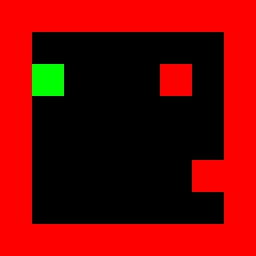
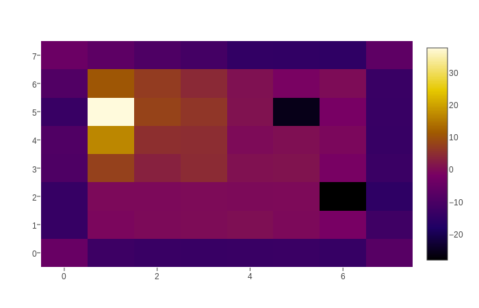
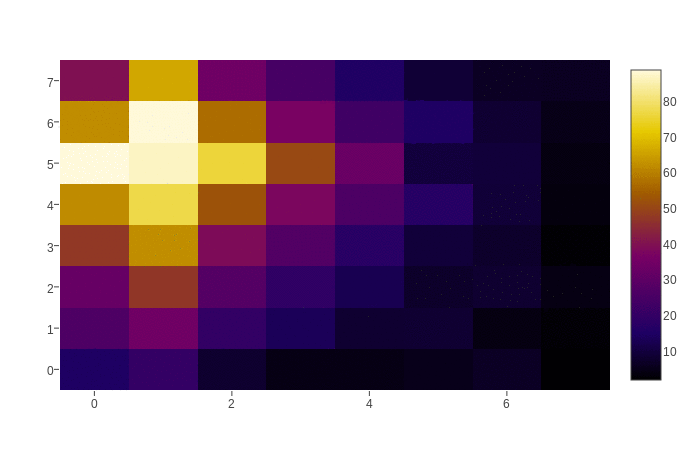
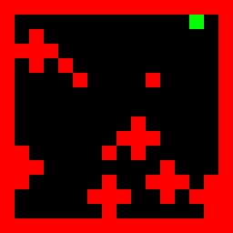
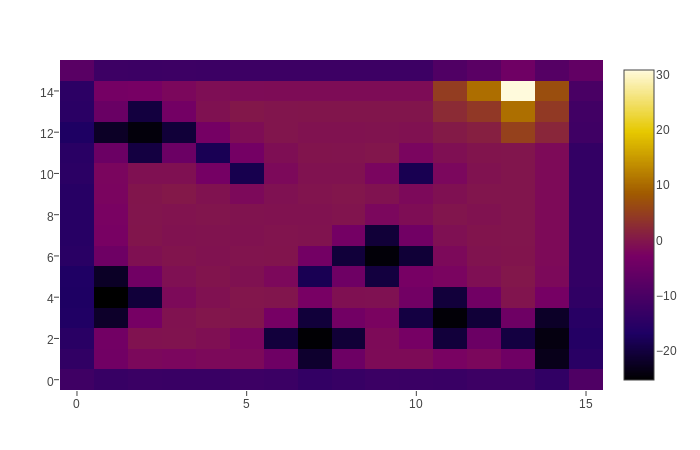
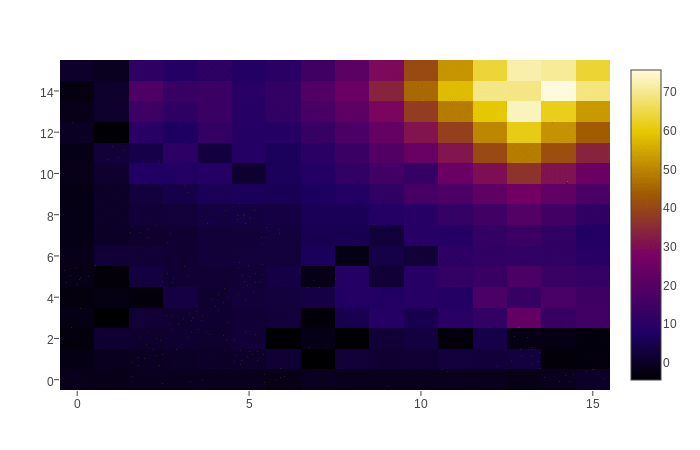
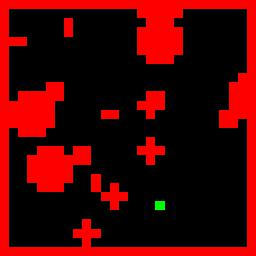
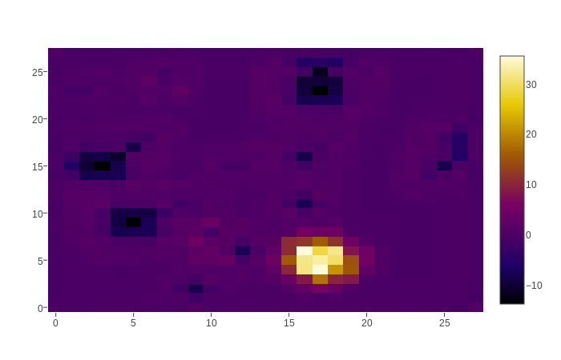
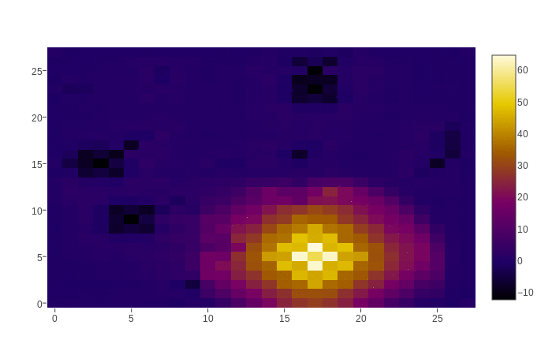

# VIN: [Value Iteration Networks](https://arxiv.org/abs/1602.02867)

This is an implementation of Value Iteration Networks (VIN) in PyTorch to reproduce the results.([TensorFlow version](https://github.com/zuoxingdong/VIN_TensorFlow))


## Key idea

- A fully differentiable neural network with a 'planning' sub-module. 
- Value Iteration = Conv Layer + Channel-wise Max Pooling
- Generalize better than reactive policies for new, unseen tasks. 

## Learned Reward Image and Its Value Images for each VI Iteration

Visualization | Grid world | Reward Image | Value Images
-- | -- | --- | ---
8x8 |  |  | 
16x16 |  |  | 
28x28 |  |  | 


## Dependencies

This repository requires following packages:
- Python >= 3.6
- Numpy >= 1.12.1
- PyTorch >= 0.1.10
- SciPy >= 0.19.0
- visdom >= 0.1

## Datasets

Each data sample consists of (x, y) coordinates of current state in grid world, followed by an obstacle image and a goal image. 

Dataset size | 8x8 | 16x16 | 28x28
-- | -- | -- | --
Train set | 77760 | 776440 | 4510695
Test set | 12960 | 129440 | 751905


## Running Experiment: Training

### Grid world 8x8

```bash
python run.py --datafile data/gridworld_8x8.npz --imsize 8 --lr 0.005 --epochs 30 --k 10 --batch_size 128
```

### Grid world 16x16

```bash
python run.py --datafile data/gridworld_16x16.npz --imsize 16 --lr 0.008 --epochs 30 --k 20 --batch_size 128
```
### Grid world 28x28

```bash
python run.py --datafile data/gridworld_28x28.npz --imsize 28 --lr 0.003 --epochs 30 --k 36 --batch_size 128
```

**Flags**:

- `datafile`: The path to the data files.
- `imsize`: The size of input images. From: [8, 16, 28]
- `lr`: Learning rate with RMSProp optimizer. Recommended: [0.01, 0.005, 0.002, 0.001]
- `epochs`: Number of epochs to train. Default: 30
- `k`: Number of Value Iterations. Recommended: [10 for 8x8, 20 for 16x16, 36 for 28x28]
- `ch_i`: Number of channels in input layer. Default: 2, i.e. obstacles image and goal image.
- `ch_h`: Number of channels in first convolutional layer. Default: 150, described in paper.
- `ch_q`: Number of channels in q layer (~actions) in VI-module. Default: 10, described in paper.
- `batch_size`: Batch size. Default: 128

## Visualization with [Visdom](https://github.com/facebookresearch/visdom)

We shall visualize the learned reward image and its corresponding value images for each VI iteration by using visdom. 

Firstly start the server

```bash
python -m visdom.server
```

Open Visdom in browser in `http://localhost:8097`

Then run following to visualize learn reward and value images.

```bash
python vis.py --datafile learned_rewards_values_28x28.npz
```

**NOTE:** If you would like to produce GIF animation of value images on your own, the following command might be useful. 

```bash
convert -delay 20 -loop 0 *.png value_function.gif
```


## Benchmarks

### GPU: TITAN X

### Performance: Test Accuracy

**NOTE**: This is the **accuracy on test set**. It is different from the table in the paper, which indicates the **success rate** from rollouts of the learned policy in the environment. 

Test Accuracy | 8x8 | 16x16 | 28x28
-- | -- | -- | --
PyTorch | 99.16% | 92.44% | 88.20% 
[TensorFlow](https://github.com/zuoxingdong/VIN_TensorFlow) | 99.03% | 90.2% | 82%

### Speed with GPU

Speed per epoch | 8x8 | 16x16 | 28x28
-- | -- | -- | --
PyTorch | 3s | 15s | 100s 
[TensorFlow](https://github.com/zuoxingdong/VIN_TensorFlow) | 4s | 25s | 165s


                    
## Frequently Asked Questions

- **Q:** How to get reward image from observation ?
    - **A:** Observation image has 2 channels. First channel is obstacle image (0: free, 1: obstacle). Second channel is goal image (0: free, 10: goal). For example, in 8x8 grid world, the shape of an input tensor with batch size 128 is [128, 2, 8, 8]. Then it is fed into a convolutional layer with [3, 3] filter and 150 feature maps, followed by another convolutional layer with [3, 3] filter and 1 feature map. The shape of the output tensor is [128, 1, 8, 8]. This is the reward image. 

- **Q:** What is exactly transition model, and how to obtain value image by VI-module from reward image ?
    - **A:** Let us assume batch size is 128 under 8x8 grid world. Once we obtain the reward image with shape [128, 1, 8, 8], we do convolutional layer for q layers in VI module. The [3, 3] filter represents the transition probabilities. There is a set of 10 filters, each for generating a feature map in q layers. Each feature map corresponds to an "action". Note that this is larger than real available actions which is only 8. Then we do a channel-wise Max Pooling to obtain the value image with shape [128, 1, 8, 8]. Finally we stack this value image with reward image for a new VI iteration. 
                    
                    

## References

- [Value Iteration Networks on arXiv:1602.02867](https://arxiv.org/abs/1602.02867)
- [Author's implementation in Theano by Aviv Tamar](https://github.com/avivt/VIN)
- [Another TensorFlow implementation by Abhishek Kumar](https://github.com/TheAbhiKumar/tensorflow-value-iteration-networks)
- [ICML 2016 Presentation by Aviv Tamar, Video](https://youtu.be/tXBHfbHHlKc)
- [NIPS 2016 Presentation by Aviv Tamar, Video](https://channel9.msdn.com/Events/Neural-Information-Processing-Systems-Conference/Neural-Information-Processing-Systems-Conference-NIPS-2016/Value-Iteration-Networks)

## Further Readings

- [Learning from the Hindsight Plan -- Episodic MPC Improvement on arXiv:1609.09001](https://arxiv.org/abs/1609.09001)
- [Cognitive Mapping and Planning for Visual Navigation on arXiv:1702.03920](https://arxiv.org/abs/1702.03920)
- [Neural Map: Structured Memory for Deep Reinforcement Learning on arXiv:1702.08360](https://arxiv.org/abs/1702.08360)
